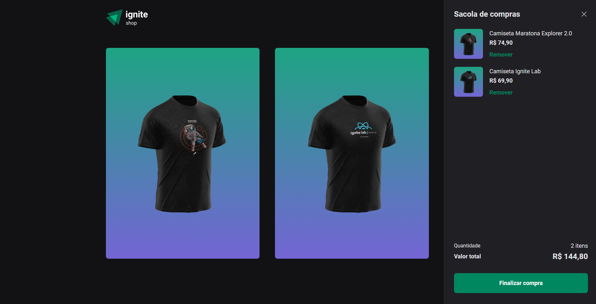

  

## Sobre o projeto
Adicionar funcionalidades ao projeto desenvolvido na aula 04 do Ignite - Rocketseat.

## ⚙️ Funcionalidades - WIP

<h4>
  ✔️ Adicionar produtos ao carrinho  
  ✔️ Somar o valor dos produtos  
  ✔️ Validações para evitar produtos duplicados  
  ✔️ Checkout utilizando Stripe com vários produtos  
</h4>

## 🛠 Tecnologias

<h4>
  React  
  TypeScript  
  Next  
  RadixUI  
  Stitches  
  Phosphoricons React  
</h4>